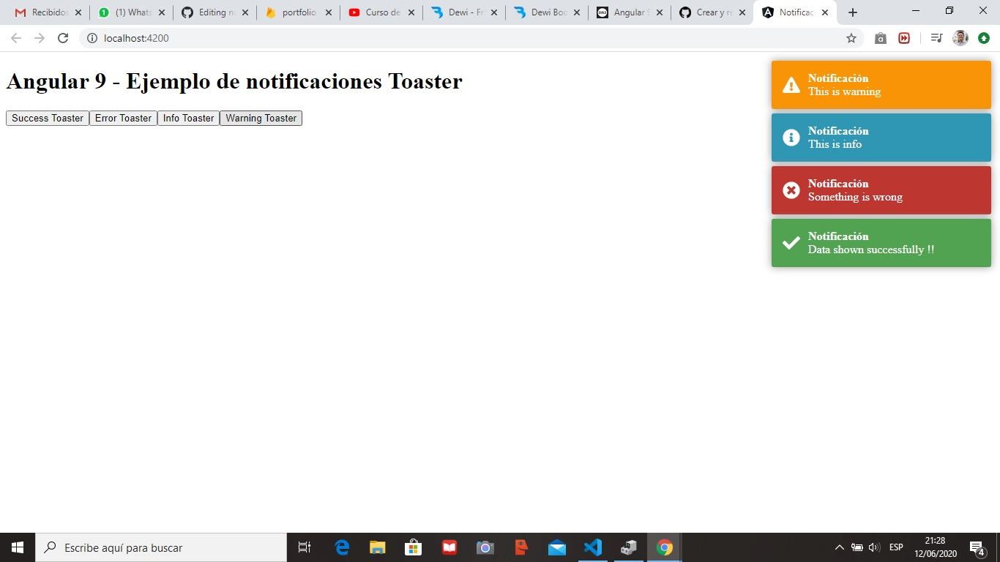

# Angular 9 - Ejemplo de notificaciones Toaster
## Toaster nos permite mostrar notificaciones de alerta: Success, Error, Warning e Info, como las que se muestran en esta imagen:



1. Creamos una nueva aplicación: `ng new notificaciones`

2. Instalamos Toaster:

```
npm install ngx-toastr --save
npm install @angular/animations --save
```

3. En el archivo `angular.css` agregamos la ruta del toast.css:

```css3
.....
    "styles": [
      "node_modules/ngx-toastr/toastr.css",
      "src/styles.css"
    ],
.....
```

4. En el `src/app/app.module.ts` importamos los módulos necesarios:

```typescript
import { BrowserModule } from '@angular/platform-browser';
import { NgModule } from '@angular/core';
  
import { AppComponent } from './app.component';
import { BrowserAnimationsModule } from '@angular/platform-browser/animations';
import { ToastrModule } from 'ngx-toastr';
  
@NgModule({
  declarations: [
    AppComponent
  ],
  imports: [
    BrowserModule,
    BrowserAnimationsModule,
    ToastrModule.forRoot()
  ],
  providers: [],
  bootstrap: [AppComponent]
})
export class AppModule { }
```

5. Creamos un nuevo servicio y lo llamamos: notificacion (notificacion.service.js):

`ng generate service notification`

6. Abrimos el arvhivo `src/app/notification.service.ts`, importamos el toastr, lo inicializamos en el constructor y añadimos las funciones para cada tipo de notificación:

```typescript
import { Injectable } from '@angular/core';
  
import { ToastrService } from 'ngx-toastr';
  
@Injectable({
  providedIn: 'root'
})
export class NotificationService {
  
  constructor(private toastr: ToastrService) { }
  
  showSuccess(message, title){
      this.toastr.success(message, title)
  }
  
  showError(message, title){
      this.toastr.error(message, title)
  }
  
  showInfo(message, title){
      this.toastr.info(message, title)
  }
  
  showWarning(message, title){
      this.toastr.warning(message, title)
  }
  
}
```

7. Para llamar a cada uno de los mensajes, agregamos los siguientes botones a la vista `src/app/app.component.html`:

```html5
<h1>Angular 9 - Ejemplo de notificaciones Toaster</h1>
  
<button (click)="showToasterSuccess()">
    Success Toaster
</button>
  
<button (click)="showToasterError()">
    Error Toaster
</button>
  
<button (click)="showToasterInfo()">
    Info Toaster
</button>
  
<button (click)="showToasterWarning()">
    Warning Toaster
</button>
```

8. En el `src/app/app.component.ts` importamos el servicio de notificación, y agregamos el llamado a las funciones de cada tipo de notificación:

```typescript
import { Component } from '@angular/core';
  
import { NotificationService } from './notification.service'
  
@Component({
  selector: 'app-root',
  templateUrl: './app.component.html',
  styleUrls: ['./app.component.css']
})
export class AppComponent {
  title = 'toaster-not';
  
  constructor(private notifyService : NotificationService) { }
  
  showToasterSuccess(){
      this.notifyService.showSuccess("Data shown successfully !!", "Notificación")
  }
  
  showToasterError(){
      this.notifyService.showError("Something is wrong", "Notificación")
  }
  
  showToasterInfo(){
      this.notifyService.showInfo("This is info", "Notificación")
  }
  
  showToasterWarning(){
      this.notifyService.showWarning("This is warning", "Notificación")
  }
}
```

9. Listo. Ahora ejecutamos el servidor: ng serve -o y hacemos click en cada botón para visualizar las notificaciones.
